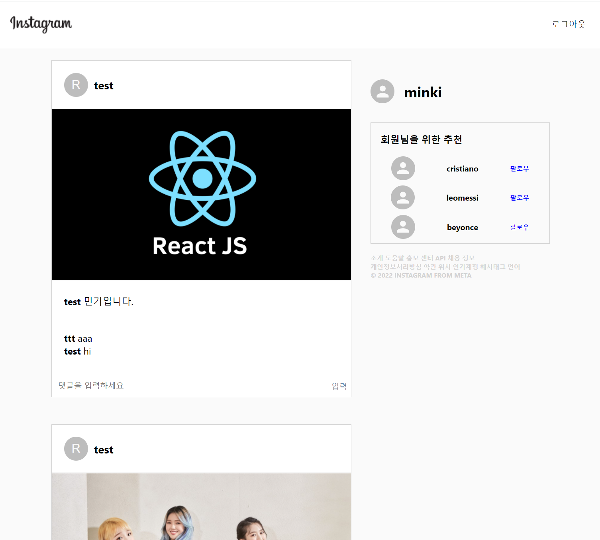
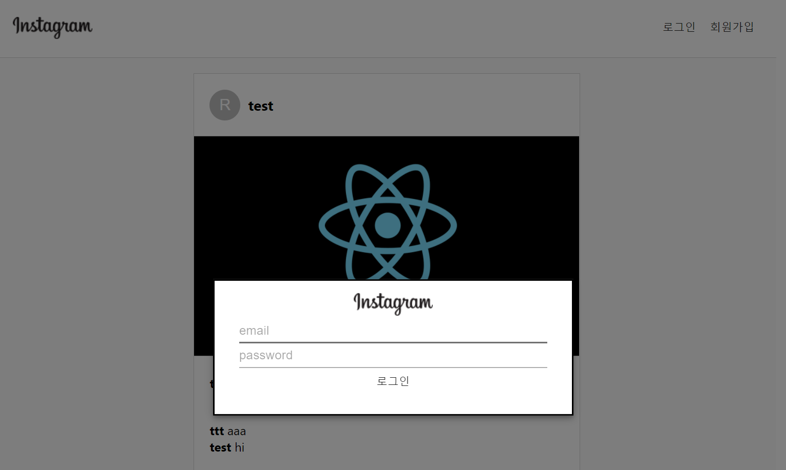
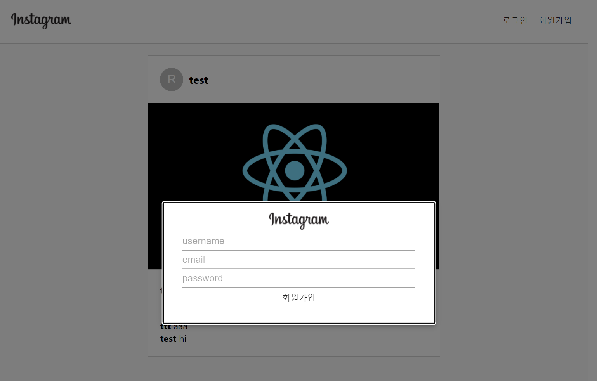
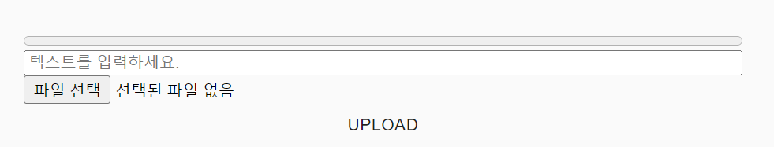
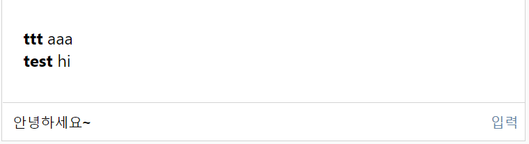

# Instagram-clone-react
* 팀원 구성 : 
  - 김민기 (메인화면 react로 구현)
  - 장우재 (Firebase Auth, Storage 구현)
  - 이승현 (Firebase 호스팅, Database 구현)

* 깃허브를 활용하여 코드 공유 및 프로젝트 진행
  
* 프로젝트 소개 : instagram을 react를 통하여 모든 기능을 구현하고자 함
* 출처: https://www.youtube.com/watch?v=f7T48W0cwXM
  

* 프로젝트 기간 : 22/03/10~ 22/03/13
* 핵심 기능 : 
  1. 게시물 보여주기 - Firebase 데이터베이스에서 게시물 불러오기
  2. 회원가입/로그인 - Firebase Authentication를 활용, 회원가입, 로그인 기능 구축 
     &nbsp; (비로그인 시 - 게시물 사진 확인만 가능, 댓글 달기, 게시물 업로드 등의 기능 활용 x)
  3. 댓글달기 - 게시물의 댓글 부분에서 댓글을 입력하고 '입력' 버튼 클릭시 댓글을 달 수 있도록 함
  4. 게시물 업로드 - 올리고자 하는 이미지 선택, 텍스트 입력 후 upload 버튼 클릭하여 게시물 업로드

* 실행화면 🖥

 <전체 화면> 
  

 <로그인 화면> 
 

 <회원가입 화면> 
 

 <게시물 작성> 
 

 <댓글 달기> 
 

 
 
## 새롭게 배운 내용
  - Firebase 의 다양한 기능 사용 : Authentication, Firestroe, Storage
  - material-ui 활용하여 기존에 만들어져있는 컴포넌트 불러와서 사용 (Avatar, Modal 등)
  - createUserWithEmailAndPassword : auth에 내장된 회원가입 메서드로 이메일 주소와 비밀번호를 가져와 유효성을 검사한 후 신규 사용자 생성하고자 할때 사용 - Firebase의 서버 데이터와 대조 후 아이디 정보가 없다면 새로 회원가입을 진행
  - onAuthStateChanged : 현재 로그인된 사용자를 불러오는 메서드
  - signInWithEmailAndPassword : email 과 password를 활용해 비동기식으로 로그인 하는 메서드
  - addDoc : 문서 작성 시 setDoc을 활용할 경우 문서의 ID를 지정해야 작성이 가능하나 addDoc을 활용시 자동으로 ID를 생성할 수 있어 이미지 업로드 및 댓글 달기에 사용

## Error revising
- Firebase Database 사용시 Realtime Database가 아닌 Firestore Database를 활용하여 instagram의 sign in, sign up, post등을 구현하고자 하였으나 오류가 발생, 해당 오류가 버전차이임을 확인하고 수정 후 오류 해결
- instagramEmbed 에서 발생한 코드 오류

## 앞으로의 개선할 사항
  1. 현재 App.js 파일에 많은 부분이 들어가 있음, 파일로 나눠서 작성
  2. material-ui를 활용하여 만들었던 컴포넌트들을 직접 코딩하여 구현하기
  3. App.js에 들어있는 스타일 관련 코드 구분하여 작성하기

